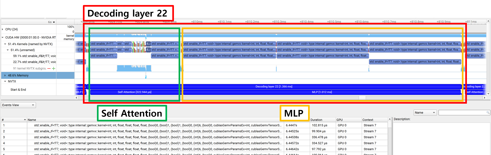
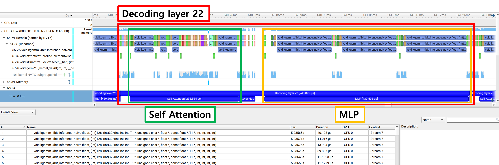
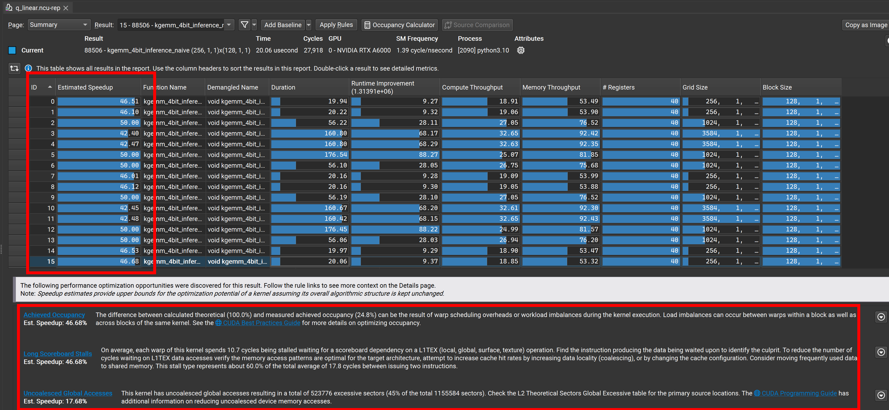

# Quantizations

## 목표

- 본 프로젝트는 Inference Optimization 프로젝트의 일부입니다. Quantization을 통해 추론을 최적화합니다.  
- Huggingface에 포함되어있는 LLM을 그대로 사용할 수 있도록 interface를 맞추고, 성능을 개선하는 것이 본 프로젝트의 목표입니다.
- 목표 수치는 다음과 같습니다.
    - 대조군
        - `Transformers==4.39.0`
        - `Llama3-8B-Instruct`
        - `native generate API without any other third-party libraries`.
    - 목표        
        - TPS : 2.8배 (with the batch size of 1)

## WIP

- HF native generate API



- kbkim Linear4bit



- 현재 native Llama3보다 
    - 1.8배 빠른 추론 속도(20 TPS -> 37.5 TPS)
    - peak VRAM memory 사용량은 19%(30.22 GB -> 5.78 GB)
    - IFEval 벤치마크 결과 native Llama3와 quantized Llama3가 같음을 확인
- 그러나 Ncu 프로파일링 결과, 아직 약 50%의 성능 개선 room이 있음



## 설치

- quantizations 레포지토리를 클론한 후, 빌드하여 패키지를 설치합니다.

```bash
# git 클론 후 프로젝트로 이동
$ git clone git@github.com:kkbwilldo/quantizations.git
$ cd quantizations

# 패키지 빌드
$ mkdir build
$ cd build
$ cmake ..
$ make

# 모듈 경로 및 공유 라이브러리 경로 추가
$ export PYTHONPATH="$PYTHONPATH:/path/to/quantizations:/path/to/quantizations/build"
```

- transformers의 모듈을 대체하여 사용합니다.

```python
# transformers/integrations/bitsandbytes.py(_replace_with_bnb_linear):L188

from modules import Linear4bit as kbkim_Linear4bit

def _replace_with_bnb_linear(
    model,
    modules_to_not_convert=None,
    current_key_name=None,
    quantization_config=None,
    has_been_replaced=False,
):
    ....
            extra_kwargs = (
                {"quant_storage": quantization_config.bnb_4bit_quant_storage}
                # bnb.nn.Linear4bit 대신 프로젝트의 Linear4bit을 사용. 해당 모듈의 인터페이스는 bnb의 것과 동일
                # if "quant_storage" in list(signature(bnb.nn.Linear4bit).parameters)
                if "quant_storage" in list(signature(kbkim_Linear4bit).parameters)
                else {}
            )
            # bnb.nn.Linear4bit 대신 프로젝트의 Linear4bit을 사용. 해당 모듈의 인터페이스는 bnb의 것과 동일
            # model._modules[name] = bnb.nn.Linear4bit(
            model._modules[name] = kbkim_Linear4bit(
                in_features,
                out_features,
                module.bias is not None,
                quantization_config.bnb_4bit_compute_dtype,
                compress_statistics=quantization_config.bnb_4bit_use_double_quant,
                quant_type=quantization_config.bnb_4bit_quant_type,
                **extra_kwargs,
            )
    ....
```

- generate API를 사용하여 추론 실행

```python
import time
from transformers import AutoTokenizer, AutoModelForCausalLM

# 프롬프트
instruction_text = """You are a pirate chatbot who always responds in pirate speak!
User: what did you have for your lunch?
"""
prompt = f"### Instruction:\n{instruction_text}\n\n### Response:\n"

# 토크나이저
model_name = "../checkpoints_llama3_8b_instruct"
tokenizer = AutoTokenizer.from_pretrained(model_name)

# TPS 반복 측정
num_iteration=5

# 생성할 토큰 수
num_new_tokens = 60

# 오리지널 모델 in 4bit
model_name = "../checkpoints_llama3_8b_instruct"
model = AutoModelForCausalLM.from_pretrained(model_name, load_in_4bit=True) # load_in_4bit=True를 추가하여 기존 bf16 모델을 fp4로 양자화

# input text 설정
input_ids = tokenizer(prompt, return_tensors='pt').input_ids.cuda()

# 텍스트 생성
start_time = time.perf_counter()
for _ in range(num_iteration):
    outputs = model.generate(input_ids, max_new_tokens=num_new_tokens, min_new_tokens=num_new_tokens, use_cache=True)
end_time = (time.perf_counter() - start_time)/num_iteration
decode = tokenizer.batch_decode(outputs, skip_special_tokens=True)[0]

print("\n\nOriginal model [Casted to FP4]")
print(decode[len(prompt):])
print(f"TPS : {num_new_tokens/end_time:.4f}\n\n")
```
